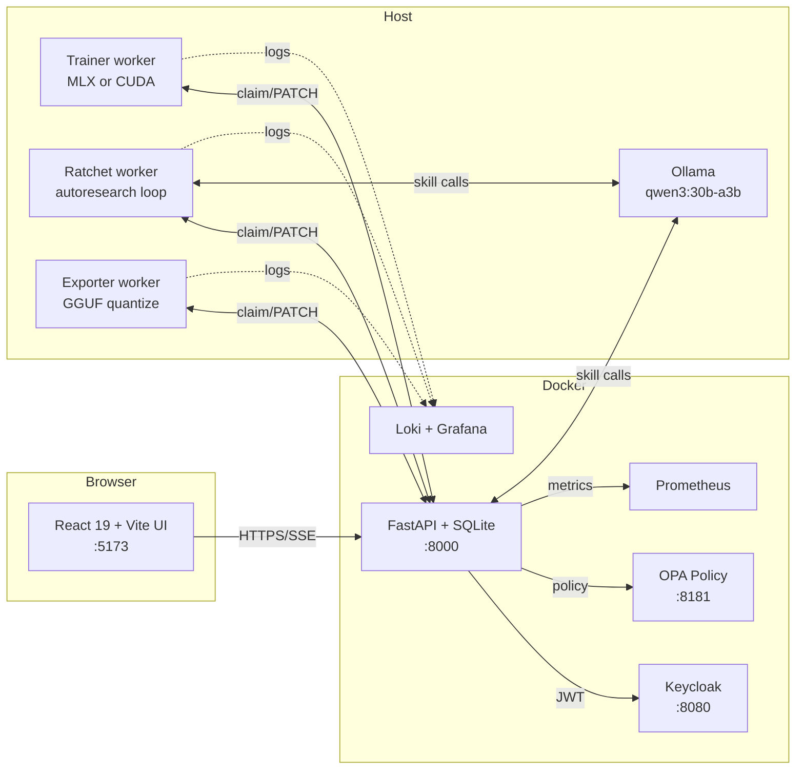

# SLM-Forge — Product Guide

> A client-friendly tour of every screen, every microservice, and every
> place Hermes / Ollama earns its keep inside SLM-Forge. Plain English;
> no PhDs required.

---

## 1. Executive summary

**What SLM-Forge is.** SLM-Forge is a local-first lab for fine-tuning
small language models (SLMs). You bring a dataset, pick a base model,
and SLM-Forge handles the rest: training, evaluation, GGUF export for
on-device inference, and an autoresearch loop that improves the
hyperparameters round after round — all driven by a local Hermes /
Ollama LLM acting as your in-house ML researcher.

**Who it's for.** Teams that want production-quality fine-tunes without
shipping their proprietary training data to a third-party cloud. Every
artifact (dataset, adapter, exported `.gguf`) stays on your machine
unless you choose otherwise.

**What you can do in five minutes.** Open the React UI, click into the
**Datasets** tab to import a CSV (or scrape a URL), click **Experiments
→ New** and let Hermes propose a fine-tuning method, then watch the
**Runs** tab as the ratchet loop walks through hyperparameters and
converges on the best model. When you're happy, **Exports** quantizes
the result to GGUF and you can run it on an iPhone, an edge device, or
plain `llama.cpp`. The whole workflow is point-and-click.

---

## 2. System architecture in one picture



**Why this layout.** The API + UI live in Docker for repeatable setup.
The workers run on the host because GPU access (Apple Metal or NVIDIA
CUDA) doesn't survive Docker on macOS, and big-iron training shouldn't
be sandboxed. Ollama is also on the host so it can see the full GPU.

**MLX vs CUDA.** SLM-Forge speaks both. On an Apple Silicon Mac the
trainer worker picks the MLX backend (Metal); on a Linux box with an
NVIDIA card it picks the CUDA backend (PEFT + TRL + bitsandbytes). The
chosen backend is recorded on each run and on each experiment, so a
mixed fleet (one Mac + one A100) shares the same API without confusion
— each worker only claims jobs that match its own backend.

---

## 3. The 11 tabs

Every tab below lists: **Purpose**, a **4-click golden path**, the
**API endpoints** it calls, and **Where Hermes / Ollama helps you**.

### 3.1 Dashboard (`/`)

**Purpose.** One-glance health check for the whole stack. If anything is
red here, no other tab will work.

**Golden path.**
1. Open the app at `http://localhost:5173`.
2. Look at the four service tiles: API, Trainer, Exporter, Ratchet —
   all should be green.
3. Look at the Hermes Agent card: Ollama up, model pulled, skills
   loaded.
4. If anything is off, click the worker tile to see the last 20 log
   lines.

**API endpoints.** `GET /api/v1/health`, `GET /api/v1/hermes/status`,
`GET /api/v1/hermes/heartbeats`, `GET /api/v1/logs/{worker}`.

**Where Hermes helps.** The Hermes status card polls the Ollama
endpoint, checks that `qwen3:30b-a3b` is pulled, and tells you exactly
which Make target to run if something's missing.

### 3.2 Experiments (`/experiments`, `/experiments/new`, `/experiments/:id`)

**Purpose.** Autoresearch sessions. Hermes proposes a fine-tuning
method, you press start, the ratchet loop runs multiple rounds of
training and reports the best run.

**Golden path.**
1. Click **+ Experiment**.
2. Pick a dataset and a base model (use the catalog default if unsure).
3. Click **Ask Hermes** — it returns a recommended method (LoRA/DoRA/
   full) plus suggested hyperparameters and a one-paragraph rationale.
4. Click **Start**. The ratchet worker takes over from here.

**API endpoints.** `GET /api/v1/sessions`, `POST /api/v1/sessions`,
`POST /api/v1/hermes/select-method`, `DELETE /api/v1/sessions/{id}`.

**Where Hermes helps.**
- **Method suggestion**: the `select_method_for_task` skill picks
  LoRA / DoRA / full based on your dataset shape and target hardware.
- **Mutation proposal (per round)**: between rounds, the ratchet worker
  calls the `propose_hyperparam_mutation` skill to nudge one or two
  hyperparameters — this is the autoresearch loop's brain.

### 3.3 Runs (`/runs`, `/runs/new`, `/runs/:id`)

**Purpose.** Individual training jobs. Either one-shot ("just train
this") or auto-spawned by an experiment.

**Golden path.**
1. Click **+ Run** (or open a row from the list).
2. Fill the form (dataset, model, method, hyperparams) — or accept the
   defaults.
3. Click **Create**. The trainer worker picks it up immediately.
4. Watch the loss curves stream live in **Run detail**.

**API endpoints.** `GET /api/v1/runs`, `POST /api/v1/runs`,
`GET /api/v1/runs/{id}`, `GET /api/v1/runs/{id}/metrics`,
`GET /api/v1/runs/{id}/stream` (SSE), `DELETE /api/v1/runs/{id}`.

**Where Hermes helps.**
- **Catalog-rejected 422s** (PR-3): if you typed a model that isn't in
  the catalog, the error response now includes a `remedy` field with
  a plain-English fix.
- **Failed run** (PR-2): the moment a run flips to `status=failed`,
  the API runs the `failure_post_mortem` skill in the background and
  writes a Markdown diagnosis to the run row + a sidecar
  `runs/<id>/post_mortem.md`. Pollable at
  `GET /api/v1/runs/{id}/post_mortem`.

### 3.4 Exports (`/exports`)

**Purpose.** Convert a finished fine-tune into a GGUF file you can run
anywhere (iPhone PocketPal, llama.cpp, Ollama).

**Golden path.**
1. Pick the source run.
2. Choose quantization levels (Q4_K_M is a sane default for phones).
3. Click **Queue export**.
4. Download the produced `.gguf` from the row.

**API endpoints.** `GET /api/v1/exports`, `POST /api/v1/exports`,
`GET /api/v1/exports/{id}`,
`GET /api/v1/exports/{id}/download/{variant}` (token-authed),
`DELETE /api/v1/exports/{id}`.

**Where Hermes helps.** The `recommend_export_quants` skill picks the
right quant level for your target device — Q8 for desktop, Q4 for
phones, Q5 for mid-range edge boxes.

### 3.5 Datasets (`/datasets`, `/datasets/new`, `/datasets/:name`)

**Purpose.** Bring data in. SLM-Forge accepts uploads (CSV/JSONL), URLs,
web scrapes, and S3 buckets, normalizes them to the format `mlx_lm.lora`
expects, and gives you a preview before you commit.

**Golden path.**
1. Click **+ Dataset**.
2. Pick a source (upload / URL / scrape / S3).
3. Inspect the preview — fields are auto-detected, sample rows shown.
   PR-4's quality scan is now running in the background (a
   `qa_id` is returned with the preview).
4. Pick prompt + response fields, click **Finalize**. Train / valid /
   canary splits are written under `data/datasets/<name>/`.

**API endpoints.** `GET /api/v1/datasets`, `POST /api/v1/ingest/{source}/preview`,
`POST /api/v1/ingest/finalize`, `POST /api/v1/synthesize`,
`GET /api/v1/ingest/qa/{qa_id}` (PR-4).

**Where Hermes helps.**
- **Preview parsing** (`ingest_dataset` skill): when the source isn't
  cleanly structured (e.g. scraped HTML), Hermes detects the
  prompt/response shape automatically.
- **Quality scan** (PR-4, `data_quality_review` skill): the moment a
  preview returns, a background task scans the first 50 rows for
  duplicates, PII, off-topic content, format mismatches, and length
  outliers, then surfaces a warning list in the UI before you commit.
- **Synthesis** (`synthesize_style_prompt` skill): the **Synthesize**
  button on a dataset card expands a small seed set into a larger
  training set using the same style as the seed.

### 3.6 Maintenance (`/maintenance`)

**Purpose.** Disk-space hygiene. Adapters, exports, and dropped runs
add up fast.

**Golden path.**
1. Open Maintenance.
2. Click **Plan cleanup** — see what would be reclaimed (read-only).
3. Review the list of safe deletions.
4. Click **Execute** if you're happy.

**API endpoints.** `GET /api/v1/admin/disk-usage`,
`POST /api/v1/admin/cleanup/plan`,
`POST /api/v1/admin/cleanup/execute`.

**Where Hermes helps.** Nothing yet — this tab is a deterministic
file-system tool, not an LLM moment.

### 3.7 Chat (`/chat`)

**Purpose.** A copilot that knows SLM-Forge inside out. Ask "show me my
runs", "propose hyperparams for my latest experiment", "what failed
last night" and it dispatches the right API tool.

**Golden path.**
1. Open Chat.
2. Pick a saved template ("Propose hyperparams for my latest
   experiment") or type your own.
3. Watch the tool cards stream in as the agent fetches data.
4. Click a metric chart inside a tool card to drill down.

**API endpoints.** `POST /api/v1/chat/conversations`,
`POST /api/v1/chat/conversations/{id}/messages`,
`GET /api/v1/chat/conversations/{id}/stream` (SSE).

**Where Hermes helps.** Everything. The chat agent is a LangGraph
state machine where Hermes / Ollama is the only LLM call; every
visible result (lists, charts, suggestions) comes from a tool the
agent dispatched.

### 3.8 R&D (`/research`)

**Purpose.** Auto-generated market-research reports on topics you
care about. Useful for picking which model / dataset / domain to bet
on next.

**Golden path.**
1. Click **New report**.
2. Type a topic ("Small LLMs for medical chatbots") and a depth
   level.
3. Wait for the Markdown to render.
4. Save / share / delete from the right rail.

**API endpoints.** `GET /api/v1/research/reports`,
`POST /api/v1/research/reports`,
`DELETE /api/v1/research/reports/{filename}`.

**Where Hermes helps.** The research engine grounds Hermes with web
search (DuckDuckGo / SerpAPI / Tavily) and then asks it to write a
structured Markdown report.

### 3.9 Agents (`/agents`)

**Purpose.** Multi-step Hermes agents. Unlike Chat (one tool at a
time), Agents chain multiple skill calls into a single named workflow
— "incident responder", "evaluation designer", etc.

**Golden path.**
1. Pick an agent kind from the dropdown.
2. Fill the input form.
3. Click **Run**.
4. Watch the per-step trace stream live; final report renders at the
   bottom.

**API endpoints.** `POST /api/v1/agents`, `POST /api/v1/agents/{id}/run`,
`GET /api/v1/agents/{id}/executions`.

**Where Hermes helps.** Every step is a skill call. Agents currently
shipped: incident responder, evaluation designer (chains
`data_quality_review` + `propose_canary_set`).

### 3.10 Traces (`/traces`, admin only)

**Purpose.** Inspect every Hermes/Ollama request + response side by
side. Indispensable for debugging prompt regressions.

**Golden path.**
1. Open Traces (admin login required).
2. Filter by source (e.g. `skill:propose_hyperparam_mutation`).
3. Click a row to see request body + response body in raw JSON.
4. Use **Clear** to drop all traces if the table grows too large.

**API endpoints.** `GET /api/v1/hermes/traces`,
`GET /api/v1/hermes/traces/{id}`,
`DELETE /api/v1/hermes/traces`,
`GET /api/v1/hermes/traces/sources/list`.

**Where Hermes helps.** This tab is the *audit trail* of every
Hermes call. PR-1 added the `tenant_id` column + per-source
redaction so dataset content is automatically scrubbed from rows
where it shouldn't appear.

### 3.11 Auto-Fixes (`/autofix`, admin only — PR-A + PR-B + PR-C)

**Purpose.** Every uncaught exception that escaped a route handler or
worker bubbles into the error responder. In production mode you get a
deduplicated GitHub issue; in development mode + `AUTOFIX_ENABLED=true`
Claude Agent SDK proposes a fix on a sandbox branch and verifies it
end-to-end. This tab surfaces every attempt.

**Golden path.**
1. Open Auto-Fixes.
2. Stats panel at the top: counts by status / source / mode.
3. Filter by status (e.g. only show `failed` to see what didn't auto-
   heal).
4. Click a row → detail drawer with redacted error message, fingerprint,
   correlation IDs, captured diff, and an **Abandon** button to stop
   the 24-hour auto-retry window for that fingerprint.

**API endpoints.** `GET /api/v1/autofix/attempts`,
`GET /api/v1/autofix/attempts/{id}`,
`POST /api/v1/autofix/attempts/{id}/abandon`,
`GET /api/v1/autofix/stats`.

**Where Hermes / SDK helps.** In dev mode the auto-fix loop calls
`claude_agent_sdk` to propose code + a reproducing test, runs the test
twice (must FAIL before the fix, PASS after), commits to
`auto-fix/<fp12>-<utcstamp>`, and never touches `main`. The whole flow
is gated by ten preflight checks (denylist, # NO_AUTOFIX marker,
attempt cap, clean tree, …).

---

## 4. Microservices catalog

| Service | What it does |
|---|---|
| **API** (`apps/api`) | FastAPI + SQLite + SQLModel. The brain. Authenticates users (Keycloak), enforces policy (OPA), persists every Run / Session / Dataset / Export / Trace / AutoFixAttempt. |
| **UI** (`apps/web`) | React 19 + Vite + Tailwind + react-router 7. The only thing users touch. Talks to the API over HTTPS + SSE. |
| **Trainer worker** (`packages/trainer`) | Host process. Claims queued runs and shells out to either `mlx_lm.lora` (Apple Silicon) or `cuda_train.py` (NVIDIA + PEFT + TRL). Streams metrics back over HTTP. |
| **Ratchet worker** (`packages/ratchet`) | The autoresearch brain. Claims queued sessions and walks them through N rounds, calling Hermes between rounds for hyperparameter mutations and persisting the best run. |
| **Exporter worker** (`packages/exporter`) | Fuses LoRA/DoRA adapters back into the base, then runs `llama-quantize` to produce GGUF artifacts. |
| **Ollama** (host) | Local LLM server. Hosts `qwen3:30b-a3b` by default. Every "Hermes" call lands here. |
| **MCP server** (`mcp_server/`) | Exposes SLM-Forge tools to Claude Desktop / Cursor / Claude Code CLI via the Model Context Protocol. |
| **Keycloak** | SSO + JWT issuer. Off by default; toggle with `make auth ENABLED=true`. |
| **OPA** | Fine-grained authorization via Rego policies in `policies/`. Same on/off switch as Keycloak. |
| **Prometheus + Loki + Grafana + Promtail** | Observability stack. JSON logs flow from the workers through Promtail into Loki; Prometheus scrapes `/metrics`. `make obs-up` brings them up. |
| **error-responder** (`packages/error_responder`, PR-A + PR-B) | Captures uncaught exceptions, fingerprints + redacts them, and routes to GitHub issue (prod) or Claude SDK auto-fix loop (dev). |

---

## 5. Hermes / Ollama integration map

Every place Hermes earns its keep, in one table.

| Where (tab + endpoint) | Skill | What the user sees | Behind the scenes |
|---|---|---|---|
| Dashboard → `/hermes/status` | — | Status pill (green / amber) | Probes Ollama version + checks `HERMES_MODEL` is pulled. |
| Experiments → `/hermes/select-method` | `select_method_for_task` | "Ask Hermes" → method suggestion with rationale | One LLM call, returns LoRA / DoRA / full + hyperparam hints. |
| Experiments (background) | `propose_hyperparam_mutation` | Round-over-round hyperparameter changes | Ratchet worker calls Hermes between rounds; mutation logged on the iteration. |
| Datasets → preview | `ingest_dataset` (fallback) | Auto-detected prompt / response fields | Used when universal-format detection isn't enough. |
| Datasets → `/synthesize` | `synthesize_style_prompt` | Background expansion of a seed set | Synthesis engine + Hermes turn 100 seed rows into 1k. |
| Datasets → preview (PR-4) | `data_quality_review` | Warnings panel (duplicates, PII, off-topic) | Background scan of the first 50 rows; polled via `GET /api/v1/ingest/qa/{qa_id}`. |
| Runs → failure (PR-2) | `failure_post_mortem` | Auto-generated Markdown diagnosis | Triggered when status transitions to `failed`; stored on the run + sidecar file. |
| Exports → quant picker | `recommend_export_quants` | "We recommend Q4_K_M for iPhone" | One LLM call, plain-English advice. |
| Runs / Synth → 4xx (PR-3) | `error_remedy` | `detail.remedy` field on the 422 / 4xx | Inline call with 4s wall-clock cap; falls back to `null` on timeout. |
| Chat → SSE stream | The chat agent's whole tool surface | Streamed tool cards + final answer | LangGraph state machine; Hermes is the only LLM call. |
| R&D → `/research/reports` | `report_writer` (engine-embedded) | Markdown report | Web search → Hermes → Markdown. |
| Agents → `/agents/{id}/run` | `evaluation_designer`, `incident_responder` | Multi-step run with per-step trace | Each step is a separate Hermes call; chained. |
| Traces (admin) | (all of the above) | Request + response side-by-side | PR-1 added `tenant_id` + per-source redaction so PII never sticks. |
| Auto-Fixes (admin, PR-A + PR-B) | (Claude Agent SDK, not Hermes) | Captured errors + proposed fixes + status | Dev-mode auto-fix loop drives `claude_agent_sdk`; prod mode opens a GitHub issue. |

---

## 6. Skills catalog

Each skill is a Markdown file in `.hermes-skills/`. Hermes loads the
file as a system prompt; the runtime supplies the user message + any
JSON context.

| Skill | Purpose |
|---|---|
| `analyze_canary_drift.md` | Detect overfitting by comparing canary loss vs validation loss; recommend regularization fixes. |
| `auto_label_unlabeled.md` | Turn raw unstructured text into chat-style training records with synthetic user prompts. |
| `data_quality_review.md` | Identify duplicates, format inconsistencies, sensitive content, and off-topic records in a dataset sample. |
| `diagnose_mps_oom.md` | Apple Silicon out-of-memory failures; recommend batch/layer/seq_length reductions. |
| `error_remedy.md` (PR-3) | Translate a raw API error into 1-3 sentences of plain-English remediation. |
| `explain_metric_anomaly.md` | Plain-English explanation of train/val divergence, loss spikes, NaN, or throughput collapse. |
| `failure_post_mortem.md` | Comprehensive post-mortem Markdown (5+ sections) for any training failure. |
| `ingest_dataset.md` | Route a dataset source (URL / S3 / upload / scrape) to the correct endpoint and suggest field mapping. |
| `model_selection.md` | Choose a base model (3B/7B/2B; Qwen/Llama/Mistral) by task, dataset size, and target device. |
| `propose_canary_set.md` | Generate 5 edge-case canary records (ambiguous inputs, refusal scenarios, OOD within domain). |
| `propose_hyperparam_mutation.md` | Stateless next-hyperparameter suggestion from iteration history; small mutations only. |
| `recommend_export_quants.md` | GGUF quantization level (F16 / Q8_0 / Q5_K_M / Q4_K_M) by target device and use case. |
| `select_method_for_task.md` | Fine-tuning method (LoRA / DoRA / full) by task type and base-model size. |
| `synthesize_style_prompt.md` | Derive style guidance (tone, structure, vocabulary, constraints) from 5-10 training records for synthesis. |

---

## 7. Glossary

- **Adapter.** The small set of trainable weights produced by LoRA /
  DoRA. Layered on top of the frozen base model.
- **Backend (trainer).** Either `mlx` (Apple Silicon) or `cuda`
  (NVIDIA). Each run + each experiment is pinned to one.
- **Canary set.** A small held-out slice used to detect overfitting
  before validation loss notices.
- **Catalog (model catalog).** The curated list of base models
  SLM-Forge officially supports. `SLM_FORGE_ENFORCE_CATALOG=false`
  lets you bypass it.
- **DoRA.** Decomposed LoRA — sometimes better quality than plain
  LoRA at similar memory cost.
- **Fingerprint (error responder).** SHA-256 of
  `exception_type | top-3 project frames`. The dedupe key for
  GitHub-issue mode + the cache key for the dev-mode auto-fix loop.
- **GGUF.** The single-file binary format consumed by `llama.cpp`,
  Ollama, and the on-device runtimes.
- **Hermes.** The local LLM agent layer in SLM-Forge. Runs on Ollama,
  defaults to `qwen3:30b-a3b`, loaded via the `packages/ratchet/
  hermes_bridge.py` chokepoint.
- **LoRA.** Low-Rank Adaptation. The default fine-tuning method.
- **Quantization.** Compressing a float-32 model into 4-bit / 5-bit /
  8-bit form for on-device inference. Q4_K_M is the sweet spot for
  phones.
- **Run.** One fine-tuning job. May be standalone or one iteration of
  a session.
- **Session / Experiment.** A series of runs orchestrated by the
  ratchet worker, walking through hyperparameter space.
- **Skill.** A Markdown file under `.hermes-skills/` that gets loaded
  as a system prompt for one Hermes call.
- **Storm protection (error responder).** Sliding 60-second window:
  if the same fingerprint fires more than `ERROR_REPORTER_STORM_THRESHOLD`
  times, further occurrences are recorded locally but not posted to
  GitHub until the window rolls.
- **Tenant.** Multi-tenant boundary marker (PR-1 A4). Every
  `HermesTrace` and `AutoFixAttempt` row carries one; single-tenant
  deployments use `"default"`.

---

## 8. Demo verification checklist

Run this on a clean checkout to prove every layer is wired up.

```bash
# 1. Setup (Python via uv; web via npm — no globals required).
make setup
make seed-data
```

```bash
# 2. Start everything. UI on :5173, API on :8000, observability on :3001.
make dev
make trainer   # in a second terminal
make ratchet   # in a third terminal
make exporter  # in a fourth terminal
make obs-up    # optional: Prometheus + Loki + Grafana
```

**Click-through (UI):**

- [ ] Dashboard — all four worker tiles green.
- [ ] Dashboard → Hermes Agent card — Ollama up, model pulled, skills
  loaded.
- [ ] Datasets → New → upload the bundled `demo.jsonl` → confirm
  preview shows a `qa_id` and the QA panel flips from `pending` →
  `ready` within ~30s (PR-4).
- [ ] Experiments → New → click **Ask Hermes** → see a method
  suggestion with rationale.
- [ ] Experiments → New → submit → watch the ratchet worker pick it
  up. After round 1, confirm `mutation_reasoning` is populated on the
  iteration row.
- [ ] Runs → kill the trainer mid-run (or POST a deliberately bad
  hyperparam) → watch `status=failed` → poll
  `GET /api/v1/runs/{id}/post_mortem` and confirm Markdown shows up
  within ~60s (PR-2).
- [ ] Runs → POST a deliberately uncataloged base model →
  confirm the 422 response carries `detail.message` AND
  `detail.remedy` (PR-3).
- [ ] Exports → queue an export → download the produced GGUF → run it
  in `llama.cpp` or PocketPal AI.
- [ ] Chat → "list my last 5 runs" → tool cards stream in.
- [ ] Traces (admin) → confirm every Hermes call from the steps above
  shows up; confirm `skill:data_quality_review` rows have redacted
  bodies (PR-1 A3).
- [ ] Auto-Fixes (admin, optional — only with
  `DEPLOYMENT_MODE=development AUTOFIX_ENABLED=true`) →
  induce a NameError in a non-denylisted file → observe a row appear
  with `status=deployed` and a new `auto-fix/<fp>` branch in `git
  branch`. Confirm `main` HEAD is unchanged.

**Smoke-test (terminal, no UI needed):**

```bash
# Catalog rejection with Hermes-generated remedy
curl -s -X POST http://localhost:8000/api/v1/runs \
  -H 'Content-Type: application/json' \
  -d '{"dataset":"demo","base_model":"totally/made-up","trainer_backend":"mlx"}' | jq .

# Expect: status_code=422, detail={"message": "...not in catalog...", "remedy": "..."}
```

```bash
# Tenant filter on the trace table
curl -s 'http://localhost:8000/api/v1/hermes/traces?tenant_id=default&limit=5' | jq .

# Expect: 5 rows, all with tenant_id="default"
```

```bash
# Auto-fix attempt admin endpoint (admin token required when auth is on)
curl -s http://localhost:8000/api/v1/autofix/stats | jq .

# Expect: {"total": N, "by_status": {...}, "by_source": {...}, "by_mode": {...}}
```

If every checkbox + every smoke-test passes, the entire pipeline —
ingest → train → autoresearch → export → audit — is healthy.

---

## 9. What's NOT shipped here

Honest about the gaps so the client doesn't get surprised:

- **Screenshots in this doc.** Placeholders for now; capture against
  your own environment.
- **Multi-API-worker.** The QA store (PR-4) is in-memory per process.
  Single uvicorn worker is the supported configuration. Promotion to
  a SQLite `qa_results` table is documented in the Ultraplan as v2.
- **Auto-fix in production.** PR-B's `AUTOFIX_ENABLED` is `false` by
  default. Production mode opens GitHub issues; dev mode runs the
  SDK loop. Auto-deploying LLM-generated code to production was
  rejected as out of scope per the safety review.
- **Translations.** English only.

---

*Generated as part of the Hermes Hardening Ultraplan (Workstream 3).
Last updated when this file was committed; see `git log` for the exact
revision.*
