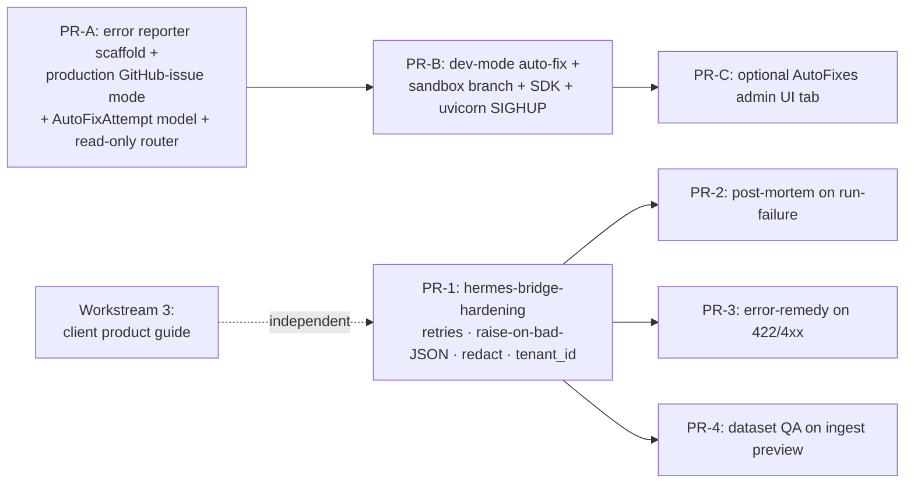

# SLM-Forge — Hermes Hardening + Self-Healing Error Reporter + Client Guide

## Context

Three workstreams the user asked for, ordered by risk/value:

1. **Hermes hardening + opportunity rollout.** The Hermes/Ollama bridge at `packages/ratchet/hermes_bridge.py` today violates four CLAUDE.md rules: no retries (`httpx.post` at L88 is single-shot), silent fallback (L190-195 in `propose_mutation` returns a fabricated `MutationProposal` on parse failure), logs raw model output (L185), and no tenant boundary on `HermesTrace`. At the same time, several skills shipped in `.hermes-skills/` (`failure_post_mortem`, `data_quality_review`, `error_remedy`) are unused. Fix the violations first, then wire the highest-leverage skills.
2. **Self-healing error reporter** via `claude_agent_sdk`. Repo-wide error capture → in production, open a GitHub issue; in development, auto-fix on a sandbox branch (main untouched), run tests, hot-reload uvicorn. GitHub repo auto-detected from `git remote get-url origin`, overridable via `GITHUB_REPO` env.
3. **Client-facing product guide** — single Markdown file `docs/client/SLM_FORGE_PRODUCT_GUIDE.md` describing every UI tab + microservice + every Hermes/Ollama touchpoint in plain English.

Intended outcome: zero CLAUDE.md violations in the Hermes path, every production error visible in GitHub with deduped fingerprints, every dev-mode error attempted-fixed automatically with safeguards (denylist, branch protection, attempt rate limits), and a single client deliverable that explains the entire product.

---

## Workstream sequencing (top level)



PR-1 must land before PR-2/3/4 (they all extend `hermes_bridge`). PR-A is independently safe to ship (default `AUTOFIX_ENABLED=false`). Workstream 3 is pure docs and parallelizable.

---

## Workstream 1 — Hermes Bridge Hardening + Three Skill Wires

### PR-1: `hermes-bridge-hardening` (single file holds 4 violations — fix together)

**Files**

| File | Change |
|---|---|
| `packages/ratchet/hermes_bridge.py` | All four fixes. |
| `packages/ratchet/loop.py` | Catch new `MutationProposalError`; record `mutation_reasoning="proposal_unparseable"`, increment `no_improvement_streak`, abort session after `HERMES_MAX_PROPOSAL_FAILURES=3` consecutive. The existing `except Exception as e` at L141 must catch the new error and NOT fabricate a fallback proposal. |
| `apps/api/models/hermes_trace.py` | Add `tenant_id: str = Field(default="default", index=True)` and `attempts: int = Field(default=1)`. |
| `apps/api/services/db.py` | New `_HERMES_TRACE_MIGRATIONS = [("tenant_id", "TEXT DEFAULT 'default'"), ("attempts", "INTEGER DEFAULT 1")]`; wire into `init_db()` after `_migrate_sessions()`. |
| `apps/api/services/tenant.py` (**new**) | `default_tenant() -> str` (env `SLM_FORGE_DEFAULT_TENANT`, fallback `"default"`); `current_tenant() -> str` (contextvar set by `RequestContextMiddleware`, falling through to `default_tenant()`). |
| `apps/api/routers/traces.py` | Add optional `tenant_id` query filter on `list_traces`. Router prefix is `/api/v1/hermes/traces` (verified in `main.py:178`). |
| `pyproject.toml` | Add `tenacity>=8.2` to base `dependencies`. |
| `.env.example` | Add nine new env vars (see below). |
| Tests | `tests/ratchet/test_hermes_bridge_retry.py`, `tests/ratchet/test_hermes_bridge_propose.py`, `tests/ratchet/test_hermes_bridge_logging.py`, `tests/api/test_hermes_trace_tenant.py`, `tests/api/test_db_migration_hermes_trace.py`. |

**Fixes**

| # | Violation (current code) | Approach |
|---|---|---|
| A1 | `_call_ollama` at L88 is single-shot. | Wrap `httpx.post` in `_post_with_retries` using `tenacity`: `stop_after_attempt(HERMES_MAX_RETRIES=3)`, `wait_exponential(min=0.5, max=4) + wait_random(0, 0.5)`. Retry only on `httpx.ConnectError`, `httpx.ReadTimeout`, `httpx.RemoteProtocolError`, and 429/502/503/504. NEVER retry 4xx (except 429). Single `HermesTrace` per logical call with `attempts` count populated by `before_sleep` callback. |
| A2 | `propose_mutation` L190-195 returns fabricated `MutationProposal(reasoning="LLM response invalid …")`. | Define `class MutationProposalError(RuntimeError)`. On `json.JSONDecodeError` or `ValidationError`, `raise MutationProposalError(...) from e`. `loop.run_session` (L135-147) catches it, sets `mutation_reasoning="proposal_unparseable"`, increments `no_improvement_streak`, and aborts session after `HERMES_MAX_PROPOSAL_FAILURES` consecutive failures. The bare `except Exception` at L141 today swallows ALL errors — narrow it to `MutationProposalError` + propagate everything else. |
| A3 | L185 `log.info("Hermes raw response …")` leaks raw model output to JSON logs. | Delete that line. Replace with `log.info("hermes_response", extra={"len": len(raw), "sha256_prefix": h[:12], "duration_ms": …})`. Top-level kill switch `HERMES_LOG_PAYLOADS=false` (default). Trace-row persistence gated by `HERMES_TRACE_STORE_PAYLOADS=true` (default true for parity with today) and `HERMES_TRACE_REDACT_SOURCES` (default redacts `skill:dataset_synth`, `skill:ingest_dataset`, `skill:auto_label_unlabeled`, `skill:data_quality_review`). Redaction blanks the body in the trace row + substitutes `"<redacted: source in HERMES_TRACE_REDACT_SOURCES>"`. |
| A4 | `HermesTrace` has no tenant column. | Add `tenant_id` (default `"default"`, indexed) on the model + additive migration. Workers resolve via `SLM_FORGE_TENANT_ID` env (falls back to `SLM_FORGE_DEFAULT_TENANT=default`); API resolves via `current_tenant()` contextvar bound in `RequestContextMiddleware`. `_record_trace` reads from `current_tenant()` (so worker context = env, API context = request). |

**New env vars** (documented in `.env.example`):

```
HERMES_MAX_RETRIES=3
HERMES_OLLAMA_TIMEOUT_S=300
HERMES_RETRY_BACKOFF_MULT_S=0.5
HERMES_MAX_PROPOSAL_FAILURES=3
HERMES_TRACE_STORE_PAYLOADS=true
HERMES_TRACE_REDACT_SOURCES=skill:dataset_synth,skill:ingest_dataset,skill:auto_label_unlabeled,skill:data_quality_review
HERMES_LOG_PAYLOADS=false
SLM_FORGE_TENANT_ID=default
SLM_FORGE_DEFAULT_TENANT=default
```

**TDD list (write FIRST; assert RED before implementing)**
- Retry: 3 read-timeouts then success → 1 trace row, `attempts=4`; 502 storm gives up → trace `error` populated; no retry on 400; `HERMES_MAX_RETRIES=1` honored.
- Proposal: `MutationProposalError` raised on invalid JSON / Pydantic validation; happy path returns parsed proposal; `loop.run_session` records skip + continues; aborts after N consecutive failures.
- Logging: capture `caplog` records → response bytes never appear (sentinel string in mocked response); `skill:dataset_synth` source redacts trace body; `skill:chat` source persists body; `HERMES_LOG_PAYLOADS=false` kills info-level emission.
- Tenant: migration adds column with default `'default'`; idempotent on repeat; `SLM_FORGE_TENANT_ID=acme` flows into trace row; `GET /api/v1/hermes/traces?tenant_id=acme` filters correctly.

**Acceptance gate:** `uv run pytest tests/ratchet tests/api -q` + `make opa-test` all green.

---

### PR-2: `hermes-opportunity-post-mortem` — uses `failure_post_mortem.md`

**Hook:** `apps/api/routers/runs.py:131 patch_run` — when the request transitions a run to `status=failed` (L141), enqueue `BackgroundTasks` calling new `apps/api/services/post_mortem.py:generate_for_run(run_id)`. (`BackgroundTasks` is already idiomatic in FastAPI; no Huey queue needed.)

**Files**

| File | Change |
|---|---|
| `apps/api/services/post_mortem.py` (**new**) | `generate_for_run(run_id)` async coroutine + module-level `asyncio.Semaphore(HERMES_MAX_CONCURRENT)` + per-run `asyncio.Lock`. Reads run row + last ~200 lines of `runs/<id>/training.log`, calls `hermes_bridge.run_skill("failure_post_mortem", payload, expect_json=False)`, stores markdown to `Run.post_mortem` and sidecar `runs/<id>/post_mortem.md`. |
| `apps/api/routers/runs.py` | Add `bg: BackgroundTasks` param on `patch_run`; on the failed-transition branch enqueue `bg.add_task(generate_for_run, run_id)`. Add new `GET /api/v1/runs/{run_id}/post_mortem` returning `{status, markdown, generated_at}`. |
| `apps/api/models/run.py` | Add `post_mortem: str \| None`, `post_mortem_status: str = "pending"`, `post_mortem_input_hash: str \| None`, `post_mortem_generated_at: datetime \| None`. |
| `apps/api/services/db.py` | Extend `_RUN_MIGRATIONS` with the four new columns. |
| `packages/ratchet/hermes_bridge.py` | Add `run_skill(name: str, payload: dict, *, expect_json: bool = False, timeout_s: float \| None = None) -> str` that loads the named skill via `load_skill` and routes through `_call_ollama` (re-uses retries from PR-1). Trace source = `f"skill:{name}"`. |
| Tests | `tests/api/test_run_post_mortem.py`, `tests/api/test_post_mortem_service.py`. |

**Behavior**
- Async via FastAPI `BackgroundTasks` — never blocks the worker's PATCH; the API responds immediately.
- `post_mortem_status` ∈ `{pending, ready, unavailable, skipped}`.
- Cache key: `sha256(error_message + last_log_line)`. Per-run `asyncio.Lock` (dict keyed by run_id) prevents duplicate generation. Module-level `asyncio.Semaphore(HERMES_MAX_CONCURRENT=2)` caps total inflight Ollama calls.
- Ollama down → `status="unavailable"`, no exception bubbled to PATCH caller.
- UI polls `GET /runs/{id}/post_mortem` every 5s while pending.

**Env vars:** `HERMES_POST_MORTEM_ENABLED=true`, `HERMES_MAX_CONCURRENT=2`.

**TDD:** patch-to-failed enqueues once; idempotent on repeat (cache hit); skill name passed correctly; markdown persisted in DB + sidecar; Ollama-down handled (status=`unavailable`); endpoint returns `pending → ready`; `tenant_id` from env appears in trace.

---

### PR-3: `hermes-opportunity-error-remedy` — new skill `.hermes-skills/error_remedy.md`

**Hook:** `apps/api/routers/runs.py:74-78 create_run` (wraps the `validate_run_request` 422) and synth router's 4xx paths in `apps/api/routers/synth.py`.

**Files**

| File | Change |
|---|---|
| `apps/api/services/remedy.py` (**new**) | `translate_error(message: str, context: dict) -> str \| None`. Uses `functools.lru_cache(maxsize=256)` keyed on `sha256(message + json.dumps(context, sort_keys=True))`. Wraps `run_skill` in `asyncio.wait_for(...)` with hard cap `HERMES_REMEDY_TIMEOUT_S=4`. On any exception or timeout returns `None`. |
| `apps/api/routers/runs.py` | In `create_run` 422 path, call `remedy.translate_error(...)` (sync since route is sync — use a thread/loop helper or make this route async). Raise `HTTPException(422, detail={"message": error, "remedy": remedy_str_or_none})`. |
| `apps/api/routers/synth.py` | Same dict-detail shape on 4xx paths in `start_synth` and `_run_synth_job`. |
| `.hermes-skills/error_remedy.md` (**new**) | Markdown skill; output is plain markdown (not JSON). Instructs Hermes to write 1-3 sentences of plain-English remediation steps. |
| `apps/web/src/lib/api.ts` | Defensive adapter: when `detail` is dict, surface `detail.message`; otherwise fall back to `JSON.stringify(detail)`. |
| Tests | `tests/api/test_remedy_translation.py`; update assertions in existing `tests/api/test_run_validation.py` to read `detail["message"]`. |

**Behavior**
- Sync from the user's perspective; hard cap `HERMES_REMEDY_TIMEOUT_S=4`. On timeout or Hermes error: `remedy=None`, original 422/4xx returned untouched.
- LRU cache dedupes identical errors → no Hermes call.
- `HERMES_REMEDY_ENABLED=true` (default) — `false` short-circuits to `remedy=None`.

**Contract change (called out in PR description):** `HTTPException.detail` becomes a `{"message": str, "remedy": str | None}` dict for these specific paths. Existing test assertions like `assert "broken" in detail` become `assert "broken" in detail["message"]`. UI adapter falls back if the field is missing.

**TDD:** remedy returned on uncataloged-model 422; remedy absent when Hermes down; timeout under 4s cap; cache hit dedupes (assert second call doesn't hit `run_skill`); `HERMES_REMEDY_ENABLED=false` skips entirely; existing 422 tests pass with adapter; synth 4xx includes remedy field.

---

### PR-4: `hermes-opportunity-dataset-qa` — uses `data_quality_review.md`

**Hook:** `apps/api/routers/ingest.py:53 _build_preview` — the single fan-in for `/upload/preview`, `/url/preview`, `/scrape/preview`, `/s3/preview`.

**Files**

| File | Change |
|---|---|
| `apps/api/services/qa_store.py` (**new**) | TTL-bounded LRU (`collections.OrderedDict`) with cap 100 and 30-min TTL; per-key `asyncio.Lock` to prevent dup work. |
| `apps/api/services/dataset_qa.py` (**new**) | `analyze(sample_rows: list[dict]) -> list[QAWarning]`. Calls `run_skill("data_quality_review", ...)` (PR-1's redact list **includes** this source — bodies redacted in trace by default). Parses output to `QAWarning(severity, category, message, row_indices)`. |
| `apps/api/routers/ingest.py` | `IngestPreview` gains `qa_id: str`; `_build_preview` enqueues async task + stores entry in `qa_store` with `status="pending"`; new `GET /api/v1/ingest/qa/{qa_id}` returns `{status, warnings}`. |
| `apps/web/src/lib/api.ts` | Extend `IngestPreview` TS type with `qa_id`; add `ingest.fetchQA(qa_id)` helper. UI integration deferred to a later FE-only PR. |
| Tests | `tests/api/test_ingest_qa.py`, `tests/api/test_qa_store.py`. |

**Behavior**
- Preview returns immediately with `warnings=[]` + `qa_id`. Background task (`asyncio.create_task`) runs `data_quality_review` on the first 50 sample rows.
- UI polls `/ingest/qa/{qa_id}` → `{status: pending|ready|unavailable, warnings: [...]}`.
- Cap `HERMES_QA_TIMEOUT_S=45`. Ollama down → `status="unavailable"`, ingest proceeds normally (warnings are advisory, not blocking).

**v1 limitation (called out explicitly):** `qa_store` is in-memory + per-process. Works with the single Uvicorn worker the API runs with today. v2 promotes to a SQLite `qa_results` table when multi-worker becomes needed.

**TDD:** preview returns non-empty `qa_id`; endpoint goes `pending → ready`; skill output parsed into `QAWarning` rows; Ollama-down yields `status="unavailable"`; cache hit dedupes; trace row body is redacted (source in default redact list); store evicts at capacity.

---

## Workstream 2 — Self-Healing Error Reporter (`claude_agent_sdk`)

User decisions locked in:
- **Dev deploy mode:** auto-commit on `auto-fix/<fingerprint>` branch + uvicorn SIGHUP reload. Main is **never** touched automatically.
- **GitHub repo:** auto-detected at startup via `git remote get-url origin`; `GITHUB_REPO` env overrides.

### Architecture

```
┌─────────────────────────────────────────────────────────────┐
│ FastAPI hooks (apps/api/main.py):                           │
│   @app.exception_handler(Exception)  ─┐                     │
│   ErrorCaptureMiddleware              ├─► capture.report()  │
│   loop.set_exception_handler          │                     │
│                                       │                     │
│ Worker hooks (packages/*/__main__.py):│                     │
│   def main(): try: main_inner()       │                     │
│     except BaseException: ────────────┘                     │
│       capture.report_sync(); flush(30s); raise              │
└──────────────────────────┬──────────────────────────────────┘
                           ▼
                  fingerprint + redact secrets
                           │
                  asyncio.Queue / queue.Queue
                           ▼
                  dispatcher background task
                           │
              ┌────────────┴────────────┐
              ▼                         ▼
     DEPLOYMENT_MODE=production    DEPLOYMENT_MODE=development
              │                         │
              ▼                         ▼
     github_issue.open_or_comment   autofix.run() (all gates)
     (httpx POST + dedup via         sandbox branch → SDK →
      GitHub search by fingerprint)  Edit → pytest → commit →
                                     SIGHUP uvicorn / restart workers
```

### Module layout (`packages/error_responder/`)

```
__init__.py        # public API: capture, report_exception, flush
config.py          # ErrorReporterSettings dataclass + get_settings() (validates at startup)
fingerprint.py     # fingerprint(), redact(), extract_top_project_frame()
reporter.py        # async + sync capture, Queue, dispatcher task
github_issue.py    # httpx POST to api.github.com (no PyGithub)
autofix.py         # sandbox + SDK + verify + commit + reload
sdk_client.py      # claude_agent_sdk wrapper (lazy import)
_git.py            # preflight_git_clean, checkout_branch, autodetect_repo
_locks.py          # /tmp/slm_forge_autofix.lock helper
metrics.py         # Prometheus counters (re-uses prometheus_client already in deps)
```

### Hook points

| Hook | File | Anchor | Purpose |
|---|---|---|---|
| FastAPI exception handler | `apps/api/main.py` | After L119 (`app = FastAPI(...)`) | Catches uncaught exceptions in routes |
| `ErrorCaptureMiddleware` | `apps/api/middleware/error_capture.py` (**new**) | Mounted in `main.py` between `PrometheusMiddleware` and `CORSMiddleware` | Catches middleware-level exceptions |
| asyncio loop handler | `apps/api/main.py` `lifespan` | After `setup_worker_logging("api")` at L113 | `loop.set_exception_handler(...)` captures silent task exceptions |
| Worker top-level | `packages/trainer/__main__.py:71-126 main()`, `packages/ratchet/__main__.py:56-111 main()`, `packages/exporter/__main__.py:53 main()` | Wrap `main()` body in `try: ... except BaseException as e: capture.report_sync(e); capture.flush(30); raise` | Captures + flushes before re-raise |

### Production mode (`DEPLOYMENT_MODE=production`)

- **HTTP client:** `httpx` (already a runtime dep). No PyGithub.
- **Repo resolution:** `_git.autodetect_repo()` parses `git remote get-url origin` (`git@github.com:owner/repo.git` or `https://github.com/owner/repo.git` → `owner/repo`). `GITHUB_REPO` env overrides; if both missing **and** `mode=production` → startup `RuntimeError`.
- **Issue title:** `[auto] {ExceptionType}: {first 80 chars of message}`.
- **Body:** fingerprint (`sha256:<12>` displayed + full sha in HTML comment), service+version+OS, correlation IDs from `packages._log_context` (`request_id`, `run_id`, `session_id`, `trace_id`), **redacted** traceback, first-3 occurrence timestamps.
- **Dedup:** `GET /search/issues?q=repo:OWNER/REPO+is:issue+"sha256:<12>"` → comment on existing if found; else open new.
- **Storm protection:** sliding 60s window per fingerprint, ≥`ERROR_REPORTER_STORM_THRESHOLD=10` → batch and only one POST. Hard cap: 30 GitHub API requests/min/process.
- **No SDK call in production mode** — body is composed server-side from the redacted traceback alone. Saves cost + risk surface.

### Development mode (`DEPLOYMENT_MODE=development AUTOFIX_ENABLED=true`)

**Step 0 — preconditions (any failure → degrade to GitHub issue, `AutoFixAttempt.status='rejected'`):**
- `AUTOFIX_ENABLED=true`
- `claude_agent_sdk` importable
- `git status --porcelain` empty
- Current branch is **not** `main`
- File lock `/tmp/slm_forge_autofix.lock` acquired (single in-flight)
- `attempts_in_24h(fingerprint) < AUTOFIX_MAX_ATTEMPTS_PER_FINGERPRINT_24H=3`
- Top project frame's file NOT in `AUTOFIX_DENYLIST`
- Top project frame's file NOT under `tests/`
- File doesn't contain a `# NO_AUTOFIX` comment

**Denylist defaults (mandatory, env-overridable comma-separated):**
```
apps/api/main.py
apps/api/services/db.py
apps/api/middleware/
packages/_logging.py
apps/api/services/model_catalog.py
packages/error_responder/
```

**Step 1 — sandbox:** prefer `git worktree add ../slm-forge-autofix-<fp12> auto-fix/<fp12>-<utcstamp>` (isolated checkout, lets the running API keep working from the main worktree). Falls back to in-place branch if `git worktree` fails or disk is constrained.

**Step 2 — SDK call:** `claude_agent_sdk.ClaudeSDKClient` with `ClaudeAgentOptions(allowed_tools=["Read","Edit","Bash"], permission_mode="acceptEdits", cwd=repo_root)`. Prompt template forces both a minimal fix AND a reproducing pytest test at `tests/regression/auto_fix/test_<fp12>.py`. `sdk_max_turns=8`, `sdk_timeout_seconds=180`.

**Step 3 — apply:** SDK Edit tool writes directly to the sandbox. Snapshot `git diff` (cap 64 KB) into `AutoFixAttempt.diff`.

**Step 4 — verify (in order):**
1. `uv run pytest tests/regression/auto_fix/test_<fp12>.py -x` — must pass.
2. **Test-quality gate:** rerun the test against the *pre-fix* code (`git stash`) — must FAIL. This blocks tautological "tests" that pass even without the fix.
3. `uv run pytest -x --timeout=120` — full suite, hard wall cap 600 s.
4. `uv run ruff check apps packages` (non-blocking, recorded).
5. `uv run mypy apps packages` (non-blocking, recorded).

Any blocking failure → `git reset --hard && git checkout <orig-branch> && git branch -D auto-fix/...` (sandbox worktree removed via `git worktree remove`), escalate to GitHub issue.

**Step 5 — auto-commit + reload:**
```bash
git add -A
git commit -m "auto-fix(<fp12>): <ExceptionType> at <file>:<line>"
# Sandbox branch only. main is NOT touched.
```
Then signal reload:
- **API:** `os.kill(uvicorn_master_pid, signal.SIGHUP)` if `--reload` is on; otherwise write sentinel `runs/_autofix_reload.signal` for an operator to pick up.
- **Workers:** emit structured log `event: autofix.restart_required, worker: <name>, branch: <auto-fix/...>`. Workers are host-bound and may be mid-training; operator restarts them. (No auto-kill of trainer/ratchet/exporter under any circumstance.)

**Step 6 — record:** `AutoFixAttempt.status='deployed'`, `completed_at=now()`.

### Data model

New table `auto_fix_attempt` (model `apps/api/models/autofix.py`, migration `_AUTOFIX_MIGRATIONS` added to `db.py`):

```python
id (pk), fingerprint (idx), mode, source, error_type, error_message (varchar 2000),
file_target, branch, test_path, status, attempt_count,
issue_url, pr_url, diff (varchar 65536), occurrences_in_window,
correlation_request_id, correlation_run_id, correlation_session_id,
tenant_id, created_at, completed_at
```

New router `apps/api/routers/autofix.py` (admin-only via existing `@requires("read","setting")` for GETs, `@requires("delete","setting")` for abandon):
- `GET /api/v1/autofix/attempts?status=&fingerprint=&limit=&offset=`
- `GET /api/v1/autofix/attempts/{id}`
- `POST /api/v1/autofix/attempts/{id}/abandon`
- `GET /api/v1/autofix/stats`

### Secret redaction (in `fingerprint.py:redact()`)

Run on traceback BEFORE entering SDK prompt or GitHub body:
- `Bearer\s+[A-Za-z0-9._-]+` → `Bearer ***`
- `(?i)(api[_-]?key|password|token|secret)\s*[:=]\s*['"]?[^'"\s]+` → `\1=***`
- `AKIA[0-9A-Z]{16}` → `AKIA***`
- `sk-(ant|live|proj)-[A-Za-z0-9_-]+` → `sk-***`
- `eyJ[A-Za-z0-9_-]+\.[A-Za-z0-9_-]+\.[A-Za-z0-9_-]+` → `<jwt-redacted>`
- `[\w.+-]+@[\w-]+\.[\w.-]+` → `<email-redacted>`

### Config + env (fail-fast at startup)

Added to `.env.example`:
```
DEPLOYMENT_MODE=development           # production | development
GITHUB_TOKEN=                         # required if mode=production
GITHUB_REPO=                          # auto-detected from `git remote` if empty
AUTOFIX_ENABLED=false                 # dev-mode kill switch
AUTOFIX_MAX_ATTEMPTS_PER_FINGERPRINT_24H=3
AUTOFIX_DENYLIST=apps/api/main.py,apps/api/services/db.py,apps/api/middleware/,packages/_logging.py,apps/api/services/model_catalog.py,packages/error_responder/
ERROR_REPORTER_STORM_THRESHOLD=10
ERROR_REPORTER_SDK_MAX_TURNS=8
ERROR_REPORTER_SDK_TIMEOUT_SECONDS=180
ERROR_REPORTER_SDK_HOURLY_CAP=100
```

Existing `ANTHROPIC_BASE_URL`, `ANTHROPIC_AUTH_TOKEN`, `ANTHROPIC_API_KEY` env (already in `.env.example` for Claude usage) are consumed by `claude_agent_sdk` directly via `os.environ`.

Hard fails at startup (`RuntimeError`):
- `mode=production` with no `GITHUB_TOKEN`.
- `mode=production` with neither `GITHUB_REPO` env nor `git remote get-url origin` parseable.
- `AUTOFIX_ENABLED=true` with `claude_agent_sdk` not importable.
- `AUTOFIX_ENABLED=true` with no Anthropic credentials in env.
- `DEPLOYMENT_MODE` not in `{"production","development"}`.

### TDD (under `tests/error_responder/`)

- Unit: `fingerprint` stability (same exception class+file+line → same hash); all 6 redact patterns covered; `config` fail-fast cases; storm threshold; denylist enforcement; `# NO_AUTOFIX` opt-out.
- Integration: GitHub mock via `respx` — issue creation, dedup via search hit, comment-on-dup, storm batching. Dev-mode mock SDK in a temp `git init` repo — sandbox branch created, test file present, commit landed, **main untouched** (asserted via `git rev-parse main`).
- E2E (`@pytest.mark.e2e`): full loop on a `git worktree`-cloned copy with an induced NameError; mocked SDK returns known good fix; assert `status='deployed'`, test in pre-fix state fails (quality gate), test in post-fix passes.
- Loop safety: induce an exception inside `error_responder` itself; assert NO recursion (capture flag), logs go to stderr only.

### Sequencing within Workstream 2

| PR | Scope | Safe to ship default |
|---|---|---|
| PR-A | Scaffold + production-mode GitHub issue path + `AutoFixAttempt` model + read-only autofix router + redaction + tests | `DEPLOYMENT_MODE=production`, `AUTOFIX_ENABLED=false` — production-safe immediately |
| PR-B | Dev-mode auto-fix flow (`autofix.py`, `sdk_client.py`, E2E test) | `AUTOFIX_ENABLED=false` by default, flippable per env |
| PR-C | React "Auto-fixes" admin tab (`apps/web/src/pages/AutoFixes.tsx`) — list, detail, abandon | Ships after PR-A+B |

---

## Workstream 3 — Client-Facing Product Guide

**Deliverable:** single file `docs/client/SLM_FORGE_PRODUCT_GUIDE.md` (create dir if absent).

**Outline (plain English, no jargon assumed):**

1. **Executive summary** (3 paragraphs) — what SLM-Forge is, who it's for, what they can do in 5 minutes.
2. **System architecture in one picture** — Mermaid showing UI (Docker) → API (Docker) → Workers (host) → Ollama (host). Two paragraphs on MLX vs CUDA backends.
3. **The 10 tabs — one section each.** Confirmed from `apps/web/src/App.tsx`:
   - **Dashboard** (`/`) — service health, Ollama reachability, log tails
   - **Experiments** (`/experiments`, `/experiments/new`, `/experiments/:id`) — autoresearch sessions
   - **Runs** (`/runs`, `/runs/new`, `/runs/:id`) — individual training jobs
   - **Exports** (`/exports`) — GGUF quantization pipeline
   - **Datasets** (`/datasets`, `/datasets/new`, `/datasets/:name`) — ingest + synth
   - **Maintenance** (`/maintenance`) — disk cleanup
   - **Chat** (`/chat`) — natural-language copilot
   - **Research** (`/research`) — Ollama-generated market research
   - **Agents** (`/agents`) — multi-step Hermes agents
   - **Traces** (`/traces`, admin) — every Hermes/Ollama call audited

   For each tab: purpose · annotated-screenshot description · 4-click golden path · API endpoints called · **where Hermes/Ollama helps you here**.

4. **Microservices catalog** — one paragraph each for: API (`apps/api`), UI (`apps/web`), Trainer (`packages/trainer`), Ratchet (`packages/ratchet`), Exporter (`packages/exporter`), Ollama, MCP server (`mcp_server/`), Keycloak, OPA, Prometheus/Loki/Grafana/Promtail.

5. **Hermes/Ollama integration map** — single table covering every touchpoint. Rows: tab + endpoint, skill used, what user sees, what happens behind the scenes. Includes: Dashboard `/hermes/status`, Experiments `/hermes/select-method`, Experiments `propose_hyperparam_mutation` (in Ratchet), Datasets `/ingest/*/preview`, Datasets `/synthesize`, Chat SSE stream, Research `/research/reports`, Agents `/agents/{id}/run`, Traces admin `/api/v1/hermes/traces`. Append rows after PR-1 ships: failed Run → post-mortem; 4xx → remedy; ingest preview → QA warnings.

6. **Skills catalog** — the 13 markdown files in `.hermes-skills/` with one-line purpose each.

7. **Glossary** — Run, Session/Experiment, Adapter, GGUF, Quantization, Canary, LoRA/DoRA, Backend.

8. **Verification checklist for the demo** — every clickable thing the user wants to show the client, in click order.

**Out of scope (acknowledged):** screenshots are placeholders; English only for v1.

---

## Critical files touched (repo-relative)

- `packages/ratchet/hermes_bridge.py` · `packages/ratchet/loop.py`
- `apps/api/models/hermes_trace.py` · `apps/api/models/run.py` · `apps/api/models/autofix.py` (new)
- `apps/api/services/db.py` · `apps/api/services/tenant.py` (new) · `apps/api/services/post_mortem.py` (new) · `apps/api/services/remedy.py` (new) · `apps/api/services/qa_store.py` (new) · `apps/api/services/dataset_qa.py` (new)
- `apps/api/routers/runs.py` · `apps/api/routers/synth.py` · `apps/api/routers/ingest.py` · `apps/api/routers/traces.py` · `apps/api/routers/autofix.py` (new)
- `apps/api/middleware/error_capture.py` (new) · `apps/api/main.py`
- `packages/trainer/__main__.py` · `packages/ratchet/__main__.py` · `packages/exporter/__main__.py`
- `packages/error_responder/` (new package, 10 files)
- `apps/web/src/lib/api.ts`
- `.hermes-skills/error_remedy.md` (new)
- `pyproject.toml` (add `tenacity`, `claude-agent-sdk`, `respx`)
- `.env.example` (~12 new env vars documented with comments)
- `docs/client/SLM_FORGE_PRODUCT_GUIDE.md` (new — Workstream 3 deliverable)

---

## Verification (end-to-end test plan)

**Workstream 1:**
- `uv run pytest tests/ratchet tests/api/test_hermes_trace_tenant.py tests/api/test_run_post_mortem.py tests/api/test_remedy_translation.py tests/api/test_ingest_qa.py -q` → all green.
- `make opa-test` → green.
- Smoke: `make dev && make ratchet`; set `OLLAMA_URL=http://127.0.0.1:9999`; start a session → expect retry logs (A1), explicit `proposal_unparseable` log (A2), no raw response bytes in any log (A3), `tenant_id="default"` on every trace row (A4).
- Smoke (PR-2): kill a trainer mid-run → run marked failed → `GET /runs/<id>/post_mortem` returns `pending` then `ready` markdown.
- Smoke (PR-3): `curl POST /api/v1/runs -d '{"base_model":"bogus","trainer_backend":"mlx"}'` → 422 with `detail.remedy` populated.
- Smoke (PR-4): POST any preview → response includes `qa_id` → poll → `warnings: [...]`.

**Workstream 2:**
- `uv run pytest tests/error_responder -q` → green.
- `uv run pytest tests/error_responder -m e2e` → full SDK loop runs on a worktree copy.
- Production smoke: `DEPLOYMENT_MODE=production GITHUB_TOKEN=<scoped-PAT>` + induce `/__crash__` route → GitHub issue appears with redacted traceback + sha256 fingerprint.
- Dev smoke: `DEPLOYMENT_MODE=development AUTOFIX_ENABLED=true` on a feature branch → induce a fixable `NameError` → observe new `auto-fix/<fp>` branch + test file + commit + uvicorn SIGHUP reload. Assert `main` HEAD unchanged.

**Workstream 3:**
- Render `docs/client/SLM_FORGE_PRODUCT_GUIDE.md` on GitHub — verify links resolve, table renders, every tab (10/10) covered, every microservice covered, every Hermes touchpoint listed (12+ rows once PR-1 lands).

---

## Top risks and mitigations

| Risk | Mitigation |
|---|---|
| Auto-fixed code lands on `main` accidentally | Sandbox branch (or worktree) only. `_git.py` refuses if current branch is `main`. E2E test asserts `git rev-parse main` is unchanged. |
| SDK call exhausts Anthropic credits | Hard cap `ERROR_REPORTER_SDK_HOURLY_CAP=100`; storm protection batches dup fingerprints; production mode never invokes the SDK. |
| LLM-generated "passing test" is tautological | Quality gate: rerun the new test against pre-fix code, assert FAIL. Enforced in `autofix._validate_test_quality`. |
| Secret leakage in tracebacks → GitHub or SDK | Mandatory `redact()` pre-dispatch with 6 patterns. Sentinel-based assertions in test suite. |
| Re-entrant capture loop (capture crashes itself) | All `error_responder` code wrapped in outer try/except BaseException logging to stderr; the package itself is in `AUTOFIX_DENYLIST`. |
| Detail-shape contract change for 422s breaks the UI | `api.ts` adapter falls back to `JSON.stringify(detail)` when `detail.message` absent. PR-3 description flags as breaking-but-compatible. |
| Multi-API-worker breaks PR-4 in-memory store | Documented v1 limitation; v2 promotes to a SQLite `qa_results` table. |
| Ollama down blocks user actions | Every Hermes wrapper has `healthcheck()` precheck + timeout cap; UI flows degrade to `status="unavailable"` with original action still completing. |
| Workers can't be safely auto-restarted mid-training | Workers emit `event: autofix.restart_required` log + sentinel. Operator (or future toast handler) restarts. API hot-reloads via SIGHUP to uvicorn. |